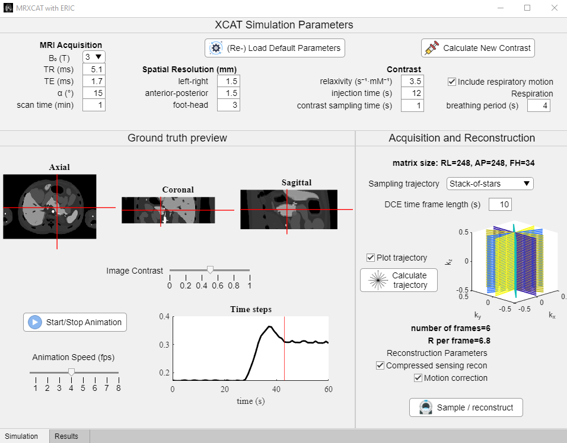

# MRXCAT with ERIC: extra-dimensional respiration with inflow of contrast

#### a MATLAB-based app designed for testing of MR sampling and reconstruction of abdominal dynamic contrast-enhanced MRI




Required MATLAB toolboxes:
* *Image Processing Toolbox*
* *Parallel Computing Toolbox*

Additional toolboxes:
* [gpuSparse](https://github.com/marcsous/gpuSparse) and [nufft_3d](https://github.com/marcsous/nufft_3d) from Mark Bydder. Note these are provided with the package but may need to be recompiled within MATLAB
* [nufft](http://web.eecs.umich.edu/~fessler/code/index.html) from Jeff Fessler and the Michigan Image Reconstruction Toolbox. Note future versions of the phantom will reduce the nufft redundancy.
* [bart](https://github.com/mrirecon/bart), either on a linux system or using a [Windows-based install](https://bart-doc.readthedocs.io/en/latest/install.html). This code was tested using bart *version 0.4.03*
* [imtool3d](https://github.com/tanguyduval/imtool3D_td) from Tanguy Duval - a really intuitive Matlab-based segmentation tool. Used for motion correction.

To start, open MATLAB at the folder containing *MRXCATwERIC.mlapp* and type:
```
MRXCATwERIC
```

Additional detailed information can be found in docs/user manual.docx